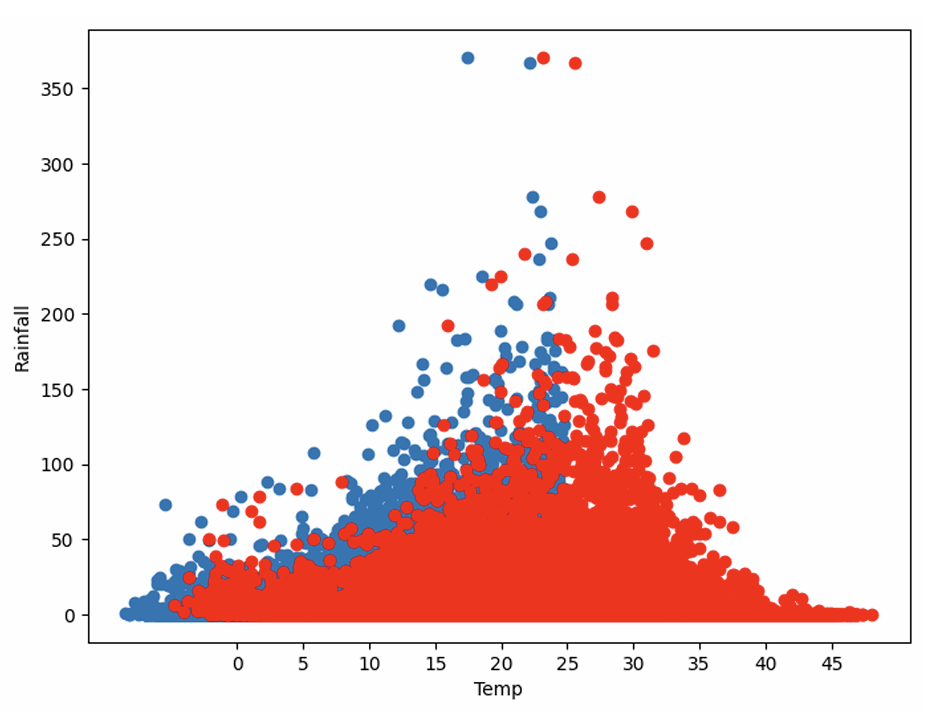
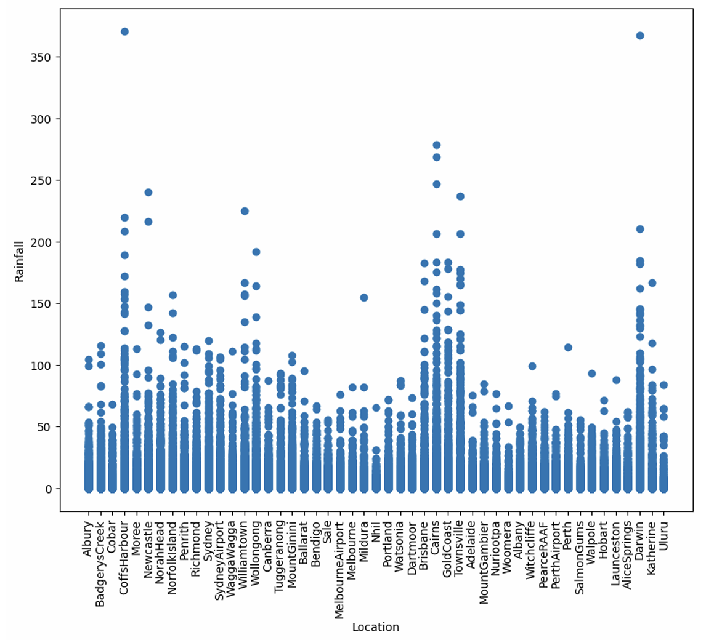
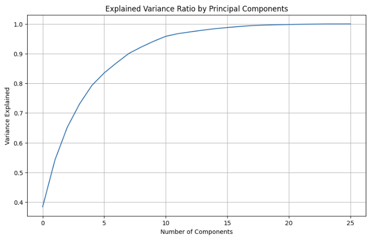
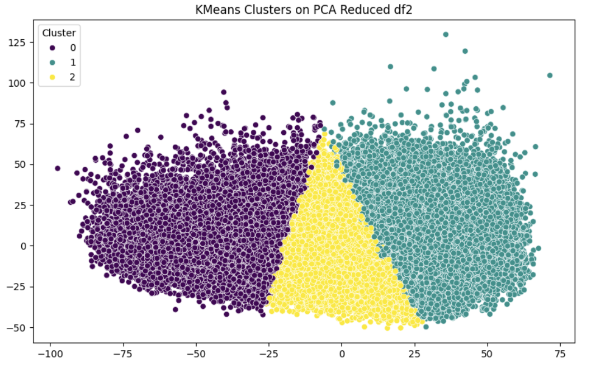
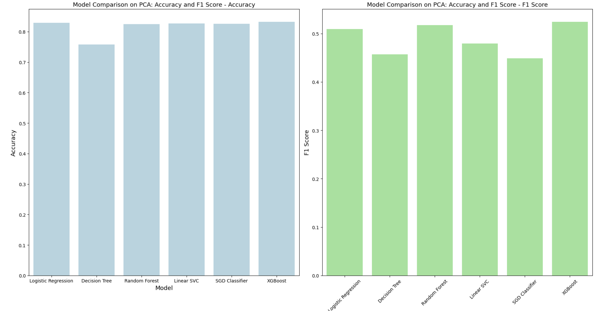
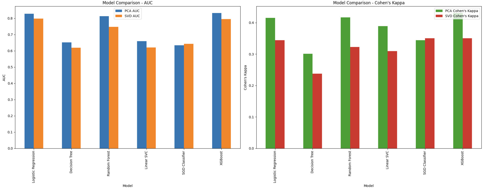

# Climate Data Analysis and Rainfall Prediction with Dimensionality Reduction and Machine Learning

This project studies rainfall prediction and broader weather pattern analysis using climate data, dimensionality reduction, clustering, and machine learning.

The final workflow combines exploratory data analysis, feature engineering, PCA, SVD, K-Means clustering, and predictive modeling to understand climate structure and improve rainfall prediction performance.

## Quick Links

- [Final report](reports/final-report.pdf)
- [Merged final code](reports/final-merged-code.pdf)
- [Final presentation](slides/final-presentation.pptx)
- [Project landing page](index.html)

## Project Focus

The project addresses an important climate analytics question: how can high-dimensional weather data be simplified without losing critical predictive information, and how effectively can that reduced representation support rainfall prediction?

The report emphasizes:

- rainfall prediction using climate variables
- dimensionality reduction with PCA and SVD
- pattern discovery through K-Means clustering
- classification and regression modeling
- interpretability through visual analysis and comparative evaluation

## Methods Used

### Data preparation

- missing-value handling
- feature engineering
- label encoding for rainfall-related categorical variables
- interaction features such as rainfall and humidity terms
- lag-based features for rainfall and temperature trends

### Dimensionality reduction

- Principal Component Analysis (PCA)
- Singular Value Decomposition (SVD)

### Unsupervised learning

- K-Means clustering
- elbow-method-based cluster selection

### Predictive modeling

- Random Forest
- Logistic Regression
- Decision Tree
- Support Vector Machine
- K-Nearest Neighbors
- XGBoost
- Linear Regression
- Gradient Boosting Regressor

### Evaluation

- accuracy
- F1-score
- ROC-AUC
- Cohen's kappa
- confusion matrix
- regression comparison plots

## Key Findings

- PCA reduced feature complexity effectively while retaining over 95% of the variance noted in the final report.
- PCA performed better than SVD in the final comparison for this project.
- K-Means clustering identified three meaningful weather-pattern groupings in the reduced space.
- The clusters reflected distinct climate behaviors such as high-rainfall/high-humidity and lower-rainfall regimes.
- Seasonal and interaction-based features improved model performance.
- Rainfall showed interpretable relationships with sunshine, temperature, wind, and geography.
- Ensemble methods delivered strong predictive performance, while reduced-dimension modeling improved interpretability.

## Final Deliverables

This repository emphasizes the polished final artifacts from the project:

- [`reports/final-report.pdf`](reports/final-report.pdf): primary written deliverable
- [`reports/final-merged-code.pdf`](reports/final-merged-code.pdf): merged final code artifact
- [`slides/final-presentation.pptx`](slides/final-presentation.pptx): final slide deck
- [`notebooks/`](notebooks): original notebook-based working files, preserved with minimal modification

## Visual Highlights

### Rainfall and climate relationships




### Dimensionality reduction and clustering




### Model comparison




## Dataset

The project is based on an Australian weather dataset used for rainfall prediction and weather-pattern analysis.

Included data files:

- `data/raw/weatherAUS.csv`
- `data/processed/data.csv`
- `data/processed/df2.csv`
- `data/processed/weatherAUS2.csv`

## Repository Structure

```text
climate-data-analysis-rainfall-prediction/
  README.md
  index.html
  .gitignore
  assets/
    images/
  data/
    README.md
    raw/
    processed/
  notebooks/
  reports/
    final-report.pdf
    final-report-source.doc
    final-merged-code.pdf
  slides/
    final-presentation.pptx
  latex/
    draft-report.tex
    final-report.tex
```

## Notes

- The notebook and code artifacts are kept close to the original project files, per request, with minimal intervention.
- The public-facing emphasis is intentionally placed on the final report, merged code document, presentation, and clear project documentation.
- The landing page is included as a portfolio-friendly project overview page that can also be used for GitHub Pages if desired.
